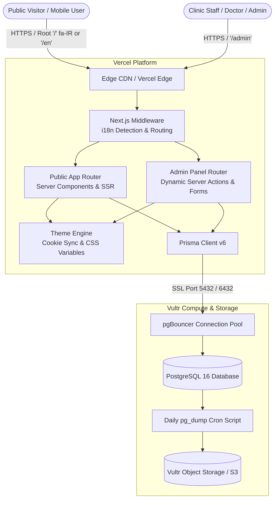

# System Architecture & Technical Specifications

This document outlines the software architecture, technical stack, layout structure, and data flows for the **Pet Boss Clinic (پت‌باس)** web application and custom administrative back office.

---

## 1. High-Level Architecture Diagram



---

## 2. Technology Stack & Architectural Justifications

| Component | Choice | Justification |
|---|---|---|
| **Web Framework** | Next.js 15 (App Router) | Best-in-class React Server Components (RSC) for maximum SEO crawlability, zero-JS content delivery, and streaming hydration. |
| **Language** | TypeScript 5.6 (Strict) | Compile-time type safety preventing runtime crashes; shared types across Prisma, Zod schemas, and UI components. |
| **Styling** | Tailwind CSS v4 + Custom Properties | Native `@theme` directives with CSS custom variables in `styles/tokens.css`, enabling instant dynamic theme switching without rebuilding CSS bundles. |
| **Database** | PostgreSQL 16 on Vultr | Relational consistency for clinic schedules, customer appointments, shop inventory, and bilingual search. Dedicated Vultr instance for cost predictability and data sovereignty. |
| **Connection Pooling** | pgBouncer | Handles high concurrent connections from serverless Vercel function instances without exhausting PostgreSQL connection limits. |
| **ORM** | Prisma 6 | Object-oriented typed query builder with complete schema migrations, type generation, and automated database seeding. |
| **Internationalization** | next-intl v3 | Robust bilingual routing serving Farsi (`fa-IR`) directly at root `/` and English at `/en` with zero hydration mismatch. |
| **Typography** | Vazirmatn + Outfit | Self-hosted variable Google Fonts. Vazirmatn provides optimal Persian glyphs, legibility, and numbers; Outfit provides modern Latin headings. |
| **Testing** | Vitest 2 + Playwright | Ultra-fast JSDOM component tests in Vitest; automated mobile (390×844) and desktop cross-browser visual tests in Playwright. |

---

## 3. Directory Layout & Route Hierarchy

```
app/
├── [locale]/
│   ├── (marketing)/
│   │   ├── about/page.tsx         # Clinic history, team, and standards
│   │   ├── contact/page.tsx       # Contact form, Google map, direct dialing
│   │   └── faq/page.tsx           # Categorized FAQ accordion
│   ├── (clinic)/
│   │   └── services/page.tsx      # Full services grouped by division
│   ├── (shop)/
│   │   └── products/page.tsx      # Pet shop catalog (Phase 1: browse only)
│   ├── (landing)/
│   │   └── lp/[slug]/page.tsx     # High-conversion Google Ads landing pages
│   ├── admin/                     # Custom back office suite (force-dynamic)
│   │   ├── layout.tsx             # Dark sidebar navigation & top bar
│   │   ├── page.tsx               # Analytics, lead summaries & stats
│   │   ├── theme/page.tsx         # Live interactive theme customizer
│   │   ├── services/page.tsx      # Clinic services CRUD
│   │   ├── divisions/page.tsx     # 3 divisions management
│   │   ├── staff/page.tsx         # Doctors, vets & license tracking
│   │   ├── products/page.tsx      # Pet shop catalog items
│   │   ├── leads/page.tsx         # Appointment requests & inquiries
│   │   ├── messages/page.tsx      # Contact inbox
│   │   ├── faqs/page.tsx          # Q&A repository
│   │   └── settings/page.tsx      # Clinic hours, address, phone & GPS
│   ├── layout.tsx                 # Root layout: ThemeProvider, next-intl, fonts
│   └── page.tsx                   # Master homepage (matching petbossclinic.jpeg)
├── feed.xml/route.ts              # RSS 2.0 Feed
├── robots.ts                      # Dynamic robots.txt
└── sitemap.ts                     # Dynamic sitemap generator
```

---

## 4. Theme & Layout Data Flow

1. **Server Rendering**:
   - `app/[locale]/layout.tsx` reads the `petboss_theme` cookie.
   - Sets `data-theme` attribute directly on the `<html>` element.
   - Prevents any flash of unstyled content (FOUC) or theme flicker during SSR.
2. **Client Hydration**:
   - `ThemeProvider` initializes with the server-passed theme.
   - Synchronizes any theme changes to `document.documentElement` and sets a persistent 1-year cookie (`petboss_theme`).
3. **CSS Variable Cascading**:
   - `styles/tokens.css` defines color tokens under `:root` and `[data-theme="..."]`.
   - Tailwind utility classes consume CSS variables (e.g., `bg-background`, `text-primary`, `border-border-gold`).

---

## 5. Security Architecture

1. **Data Sanitization**: All form inputs are validated on both client and server via Zod schemas.
2. **Database Isolation**: Direct database access is restricted via VPC firewall; only Vercel egress IPs and authenticated SSH tunnels can access PostgreSQL.
3. **Security Headers**: Content Security Policy (CSP), Strict-Transport-Security (HSTS), X-Content-Type-Options, and Referrer-Policy configured via Next.js response headers.
