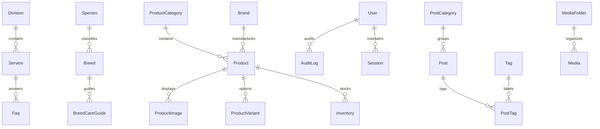

# Data Model & Database Architecture — Pet Boss Clinic

> **Database Schema & Entity-Relationship Architecture**  
> Complete technical reference for the PostgreSQL 16 database managed through Prisma ORM (`prisma/schema.prisma`).

---

## 1. Architectural Principles

1. **Bilingual-First Data Design:**
   - Farsi content is mandatory (`*Fa` fields like `nameFa`, `descriptionFa`).
   - English content is optional (`*En` fields like `nameEn`, `descriptionEn`) with fallback logic.
   - All slug pairs (`slugFa`, `slugEn`) are indexed and unique where present.
2. **Soft Deletes:**
   - Core entities use `deletedAt DateTime?` to prevent accidental loss of operational history (Services, Staff, Products, Categories, Posts).
3. **Audit Logging & Security:**
   - Administrative actions and changes write structured before/after JSON diffs to `AuditLog`.
   - Login attempts and IP addresses are tracked via `LoginAttempt`.
4. **Phase 1 vs. Phase 2 Segmentation:**
   - **Phase 1 (Active):** Clinic content, species/breed encyclopedias, catalog browsing, lead capture, contact forms, and admin CMS.
   - **Phase 2 (Schema-Defined, Commented Stubs):** E-commerce checkout, carts, online payments (Zarinpal), appointment booking slots, pet electronic health records.

---

## 2. High-Level Entity Relationship Diagram



---

## 3. Domain Model Taxonomy

### 3.1 Identity & Access Control
| Model | Description | Key Attributes |
|---|---|---|
| `User` | Internal staff, admins, and future pet owners | `email`, `role` (SUPER_ADMIN, ADMIN, EDITOR, AUTHOR, VIEWER), `totpSecret`, `totpEnabled` |
| `Account` / `Session` | NextAuth compatible authentication tables | OAuth tokens, session persistence |
| `Permission` / `RolePermission` | Fine-grained RBAC permission matrix | `name`, `description`, role linkage |
| `AuditLog` | Comprehensive administrative activity log | `userId`, `action`, `entity`, `entityId`, `before`, `after`, `ip` |
| `LoginAttempt` | Brute force defense and security telemetry | `email`, `ip`, `success`, `createdAt` |

### 3.2 Clinic Content & Services
| Model | Description | Key Attributes |
|---|---|---|
| `Division` | Clinical departments (Internal, Surgery, Grooming, Shop) | `slugFa`, `slugEn`, `nameFa`, `nameEn`, SEO meta fields |
| `Service` | Medical & grooming procedures | `divisionId`, `nameFa`, `priceFrom`, `priceTo`, `durationFa`, `benefitsFa` |
| `StaffMember` | Veterinarians, surgeons, groomers | `nameFa`, `titleFa`, `specialtyFa`, `licenseNo`, `socials`, `photoId` |
| `Specialty` | Medical specialties taxonomy | `nameFa`, `nameEn` |
| `WorkingHour` | Clinic operational schedule per day of week | `dayOfWeek` (0-6), `openTime`, `closeTime`, `isClosed` |
| `Certificate` / `Facility` | Clinic accreditations and surgical equipment showcases | `nameFa`, `issuerFa`, `year`, `imageId` |

### 3.3 Species & Breed Encyclopedia
| Model | Description | Key Attributes |
|---|---|---|
| `Species` | Animal types (Dog, Cat, etc.) | `nameFa`, `nameEn`, relational links to breeds and products |
| `Breed` | Comprehensive breed guides | `slugFa`, `sizeFa`, `temperamentFa`, `groomingNeedsFa`, `commonHealthIssuesFa` |
| `BreedCareGuide` | In-depth care and nutritional articles | `breedId`, `titleFa`, `contentFa` |

### 3.4 Shop (Phase 1 Showcase & Catalog)
| Model | Description | Key Attributes |
|---|---|---|
| `ProductCategory` | Hierarchical shop categories (nested parent/child) | `slugFa`, `nameFa`, `parentId` |
| `Brand` | Premium pet food & accessory manufacturers (Royal Canin, Reflex, etc.) | `nameFa`, `slugFa`, `logoId` |
| `Product` | Catalog items | `price`, `comparePrice`, `stockStatus` (IN_STOCK, LOW_STOCK, OUT_OF_STOCK), `isPurchasable` (defaults `false` in Phase 1) |
| `ProductImage` | Multi-image product gallery | `productId`, `imageId`, `isPrimary`, `sortOrder` |
| `ProductVariant` | Size/color variants (e.g. 2kg, 10kg, 15kg bags) | `sku`, `nameFa`, `price`, `stockStatus` |
| `Inventory` | Stock tracking per warehouse/clinic location | `productId`, `quantity`, `location` |

### 3.5 Marketing, CMS & Communications
| Model | Description | Key Attributes |
|---|---|---|
| `Lead` | High-intent prospective patient inquiries | `name`, `phone`, `source`, `utmSource`, `utmMedium`, `utmCamp`, `status` |
| `ContactMessage` | Inquiries submitted via `/contact` | `name`, `email`, `phone`, `subject`, `message`, `isRead` |
| `Faq` / `FaqCategory` | Structured questions with Schema.org JSON-LD | `questionFa`, `answerFa`, `serviceId`, `categoryId` |
| `Post` / `PostCategory` | Educational veterinary blog | `slugFa`, `titleFa`, `contentFa`, `authorId`, `publishedAt` |
| `LandingPage` | Ad-specific PPC landing pages (`/lp/[slug]`) | `slugFa`, `titleFa`, `contentFa`, `noindex: true` |
| `Keyword` | Target SEO keyword inventory | `term`, `locale`, `volume`, `difficulty`, `mappedUrl` |

### 3.6 Theming & Dynamic Design
| Model | Description | Key Attributes |
|---|---|---|
| `Theme` | Active site themes | `name`, `isDefault`, `tokens` (JSON map of CSS variables) |
| `ThemePreset` | Curated presets (Luxury Dark, Luxury Light, Emerald Prestige, Royal Obsidian) | `name`, `tokens` |
| `UserThemePreference` | User-selected theme override | `userId`, `preference` |

### 3.7 Media Library
| Model | Description | Key Attributes |
|---|---|---|
| `MediaFolder` | Nested folder hierarchy for asset organization | `name`, `parentId` |
| `Media` | Managed image and document assets | `url`, `key`, `mime`, `size`, `width`, `height`, `blurhash`, `altFa` |

---

## 4. Phase 2 Schema Extensions (Stubs)

The following models are fully defined in the schema and ready for migration when Phase 2 development begins:

1. **E-commerce Ordering & Payment:**
   - `Cart` & `CartItem`: Multi-tenant persistent shopping cart.
   - `Order` & `OrderItem`: Order state machine (`PENDING`, `PAID`, `FULFILLED`, `CANCELLED`).
   - `Payment`: Transaction tracking for Iranian banking gateways (Zarinpal, Saman, Mellat) with `transactionId` and `gateway`.
2. **Electronic Health Records (EHR) & Online Booking:**
   - `PetOwner`: Linked profile with verified Iranian mobile number.
   - `Pet`: Animal profile with species, breed, birthdate, and microchip number.
   - `AppointmentRequest` & `AppointmentSlot`: Real-time veterinarian calendar slots and booking requests.
   - `MedicalRecord` & `VaccinationRecord`: Clinical consultation notes, diagnostic findings, and vaccination schedules with automatic reminder triggers.

---

## 5. Database Connection & Migration Commands

The production database is hosted on Vultr (Ubuntu 22.04 LTS) running PostgreSQL 16.

```bash
# Generate Prisma client after schema modifications
npx prisma generate

# Create and apply a new migration in development
npx prisma migrate dev --name <migration_name>

# Apply migrations in production/CI environments
npx prisma migrate deploy

# Seed the database from scaffold/seed-data.md
npx tsx prisma/seed.ts

# Launch Prisma Studio for direct data inspection
npx prisma studio
```

### Connection String Strategy
- **`DATABASE_URL`**: Direct connection string to PostgreSQL on port `5432` used for migrations and runtime queries.
- **`DIRECT_URL`**: Direct unpooled connection required for Prisma schema introspection and migrations.
- **PgBouncer Port (`6432`)**: Available for high-concurrency connection pooling once transaction pool settings are configured.
