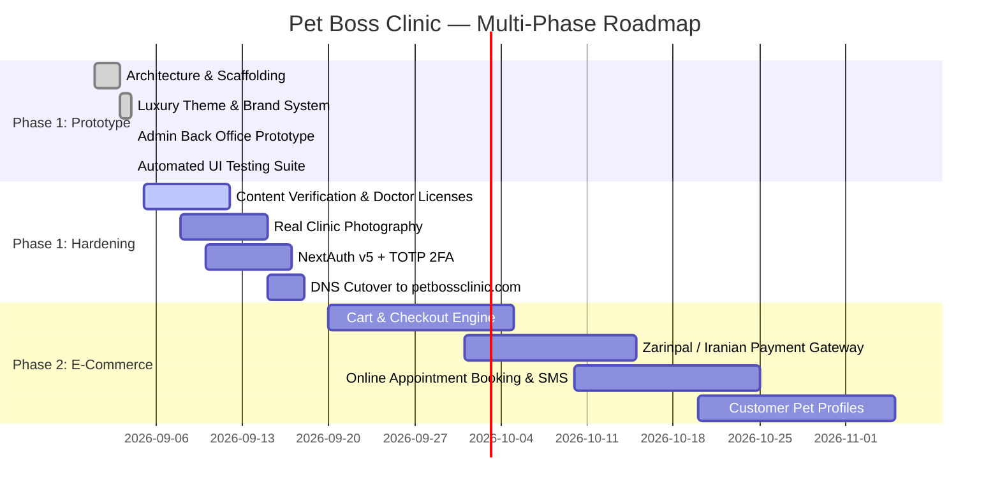

# Product Roadmap & Phase Plan

This document defines the development phases, current prototype status, hardening requirements, and the transition path from **Phase 1 (Scaffold & Marketing Prototype)** to **Phase 2 (E-Commerce & Online Appointments)**.

---

## 📌 Status Confirmation: Phase 1 Prototype

> [!NOTE]
> The current web application and admin panel represent the **Phase 1 Working Prototype & Architectural Foundation**. The layout, theme engine, database schema, routing, and back-office modules are fully built and functioning with realistic seed data. It is designed for operational review before production hardening.

---

## 🗺️ Roadmap Overview

---

## 1. Phase 1: Current State (Complete Working Prototype)

| Capability | Status | Implementation Details |
|---|---|---|
| **Visual Theme** | ✅ Complete | Luxury matte charcoal (`#181A20`) + metallic gold (`#C5A059`) matching `petbossclinic.jpeg` |
| **Brand Assets** | ✅ Complete | Crowned Lion vector logo (`<PetBossLogo />`) + 6 golden pill badges (`<LuxuryPillBadge />`) |
| **Dynamic Theming** | ✅ Complete | 4 presets, live preview customizer in `/admin/theme`, 1-year cookie persistence |
| **Farsi-First Routing** | ✅ Complete | `/` serves Farsi RTL with Vazirmatn font; `/en` serves English LTR with Outfit font |
| **3 Core Divisions** | ✅ Complete | Clinical, Grooming, and Pet Shop prominently featured across navigation and cards |
| **Public Pages** | ✅ Complete | Homepage, Services, About, Contact (with exact map pin), FAQ accordion |
| **Admin Back Office** | ✅ Complete | 10 modules: Dashboard, Theme, Services, Divisions, Staff, Products, Leads, Messages, FAQs, Settings |
| **Testing Suite** | ✅ Complete | 15 Vitest tests passing; 0 TypeScript errors; 0 ESLint errors; 36 static pages built |

---

## 2. Phase 1 Hardening (Pre-Launch Checklist)

Before public launch on the primary domain `petbossclinic.com`:

1. **Medical Staff Verification (`# VERIFY`)**:
   - Obtain real veterinarian names, specialty certificates, and Veterinary Council License Numbers (شماره نظام دامپزشکی).
   - Input verified data via `/admin/staff`.
2. **Photography & Media**:
   - Replace placeholder seed images with professional photographs of the Gheitariyeh clinic rooms, grooming station, and pet shop shelves.
   - Store assets in Vultr Object Storage via the media library.
3. **Admin Authentication**:
   - Lock down `/admin` behind NextAuth v5 credentials.
   - Enforce TOTP two-factor authentication (Google Authenticator) for administrative roles.
4. **Pricing Review**:
   - Confirm base Toman prices for vaccination, parasite therapy, and surgery with clinic management.
5. **DNS & SSL Finalization**:
   - Point `petbossclinic.com` and `www.petbossclinic.com` to Vercel via Ventraip DNS management (see [dns.md](./dns.md)).

---

## 3. Phase 2: E-Commerce & Online Booking (Future Phase)

> [!TIP]
> The database schema in `prisma/schema.prisma` already includes the data models for Phase 2 (commented and ready). Feature flags in `lib/feature-flags/` currently toggle these features off.

### 3.1 Pet Shop E-Commerce
- **Shopping Cart & Checkout**: Interactive slide-over cart, address entry with Tehran district selector, and delivery cost calculation.
- **Iranian Payment Gateways**: Integration with **Zarinpal**, **IDPay**, or **Zibal** (SHAPARAK compliant) via server actions.
- **Order Management**: Order tracking, invoice generation, and status transitions (`PENDING`, `PAID`, `PACKED`, `SHIPPED`, `DELIVERED`).
- **Inventory Control**: Live stock deduction and low-stock alerts in the admin panel.

### 3.2 Online Appointment Scheduling
- **Slot Reservation**: Dynamic calendar showing doctor availability for clinical checkups, vaccination, and grooming sessions.
- **SMS Gateway Integration**: Automatic SMS confirmations and appointment reminders sent via **Kavenegar** or **FarazSMS** to Iranian mobile numbers (`+98912XXXXXXX`).
- **Medical Records**: Digital pet vaccination history and doctor diagnosis logs viewable by pet owners.

---

## 4. Phase 3: Mobile App & Ecosystem

- **Native Mobile Apps (iOS / Android)** built with React Native / Expo consuming the typed REST endpoints under `app/api/v1/`.
- **Pet Boss Club**: Loyalty reward points on clinic visits and pet shop purchases.
